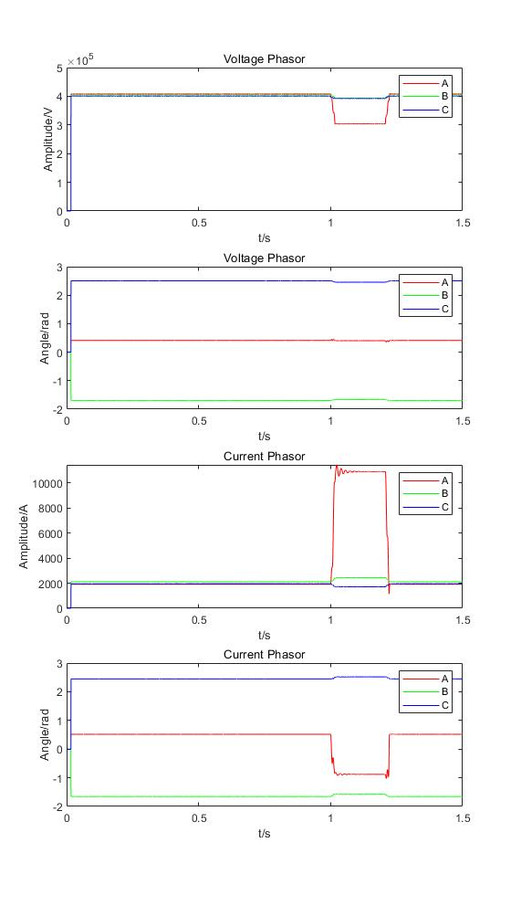

# EE271 Project Report

朱宇轩 2020531016

## Introduction and Scope

The power system is an important cornerstone of the stable development of today's society. The stability of power supply is often affected by human activities, natural disasters, etc. In order to prevent hardware damage caused by long-term faults in the system, a fast-acting protection device should trip as soon as a fault is detected. However, tripping indefinitely greatly increases the area of effect of an outage. Therefore, distance relay is often widely used in power systems.

## Problem Formulation 

In order to increase the reliability of the protection device, a single distance relay should not only monitor the fault in its zone, but also serve as a backup for subsequent protection devices. Therefore, according to the design plan given in the course, the working area of the protective device is divided into three parts, and its detailed parameters are as follows

|                                       | Magnitude of $Z_{relay}$ | Angle of $Z_{relay}$ | Time delay | Compensation  factor $k$ |
| ------------------------------------- | ------------------------ | -------------------- | ---------- | ------------------------ |
| Zone 1(80%$Z_{this}$)                 | $219.9933\Omega$         | $88.2269$°           | 2 cycles   | $2.3937\angle -19.1193$° |
| Zone 2(125%$Z_{this}$)                | $343.7396\Omega$         | $88.2269$°           | 15 cycles  | $2.3937\angle -19.1193$° |
| Zone 3(100%$Z_{this}$+125%$Z_{next}$) | $540.3509\Omega$         | $88.0799$°           | 35 cycles  | $2.3937\angle -19.1193$° |

## Solution Methodology  

### Step 1 Read the Comtrade files

The first of all is to obtain some global settings from the 'cfg' file, in the order of rated voltage, total length of transmission line, number of channels, name of each channel, variation factor A, variation factor B, time offset, frequency of the system, sample rate, the number of the samples and the encoding format of the 'dat' file.

Then we obtain the following information
$$
f = 60Hz\\
Sample\ Rate =4800Hz\\
\# \ of\ samples=7200\ per\ channel\\
Encoding\ format:Binary\\
$$
With the knowledge, that the real value $Y$ has the following relationship with $X$ 
$$
Y=A*X+B
$$
the value of the voltage and current can be calculated from the 'dat' files.

Moreover, the sample time of each data point can also be read from the 'dat' files, as we have already known that the time offset for all the channels are 0, thus the data we obtained does not need any further adjustment.

### Step 2 Calculate Phasors

According to the requirements of the problem, we calculate the phasors over a sliding 1-power frequency cycle window, i.e. $80$ data points.

With the IEEE standard that
$$
A \cos \phi=\frac{\int_{T} V_{i}(t) * \cos (\omega t) d t}{\int_{T} \cos ^{2} \omega t d t}\\
B \sin \phi=\frac{\int_{T} V_{i}(t) * \sin (\omega t) d t}{\int_{T} \sin ^{2} \omega t d t}\\
\tilde{V}_i=A \cos \phi-1j*B \sin \phi
$$
we can calculate the phasor for every data point.

It is worth mentioning that each calculated phasor uses data points from the previous cycle. The reason for this definition is that in real systems, we cannot obtain future voltage or current waveforms in advance. At the same time, the advantage of this definition is that when a fault occurs, the time-domain mutation and the phasor mutation will occur at the same time point, avoiding ambiguity.

Moreover, we can calculate the zero sequence current by
$$
\tilde{I}_0=\frac{1}{3}(\tilde{I}_a+\tilde{I}_b+\tilde{I}_c)
$$

### Step 3 Calculate the impedance seen by the relay

With the knowledge given by the professor, we can list the impedance formula and its corresponding fault type as the following table

|                     impedance formula                     | fault type | Impedance number |
| :-------------------------------------------------------: | :--------: | :--------------: |
|             $\frac{\tilde{V}_a}{\tilde{I}_a}$             |  3 phase   |        1         |
|             $\frac{\tilde{V}_b}{\tilde{I}_b}$             |  3 phase   |        2         |
|             $\frac{\tilde{V}_c}{\tilde{I}_c}$             |  3 phase   |        3         |
| $\frac{\tilde{V}_a-\tilde{V}_b}{\tilde{I}_a-\tilde{I}_b}$ |   AB(G)    |        4         |
| $\frac{\tilde{V}_b-\tilde{V}_c}{\tilde{I}_b-\tilde{I}_c}$ |   BC(G)    |        5         |
| $\frac{\tilde{V}_c-\tilde{V}_a}{\tilde{I}_c-\tilde{I}_a}$ |   CA(G)    |        6         |
|      $\frac{\tilde{V}_a}{\tilde{I}_a+k\tilde{I}_0}$       |     AG     |        7         |
|      $\frac{\tilde{V}_b}{\tilde{I}_b+k\tilde{I}_0}$       |     BG     |        8         |
|      $\frac{\tilde{V}_c}{\tilde{I}_c+k\tilde{I}_0}$       |     CG     |        9         |

Since we have obtained the phasors of all the voltages and currents, we can calculate the 9 impedance seen by the rely of every sample time.

### Step 4 Issue a trip command  

In order to simulate the field environment, we calculate whether to trip or not in chronological order.

For a certain time, we have calculated the nine impedance values that the relay sees in the previous step. So at this moment, we compare these impedance values with the settings we obtained in the previous chapter respectively. If a certain impedance value is in a certain working zone, start the timer corresponding to the fault type and the working zone, otherwise, clear the timer. At the same time, compare the elapsed time of the timer with the time delay in the setting value, and if the time delay condition has been met, a trip signal will be issued. If there is no trip, it throws a no-zone fault signal at the end.

## Result of Case 1

### Time Domain Waveform

### Phasors

From the above figures, we can vividly seen that the fault occurs on phase A at $t=1s$ with high probability.

### Trip output

Relay 7 means the fault is detected by the seventh impedance in the table in Step 3, its corresponding fault type is $AG$, and the relay trips after 2 cycles (0.33 s), which is the same as we set for Zone 1.

### impedance Figures

### Impedance Figure for Relay 7

As we can see, after the fault occurs at $t=1.000s$, the impedance seen by Relay 7 enters Zone 1, 2, 3 successively, and stays in Zone 1 for more than 2 system cycles, which leads to a trip caused by Zone 1 of Relay 7.

## Result of Case 2

### Time Domain Waveform

### Phasors

The figure told us that the fault may occur on phase B and C.

### Trip output

### Impedance Figure

These nine figures give out the same result as the previous section "Trip output", although the impedance may sometimes enter some certain zones, it won't stay too long. As a result, the fault occurs in case 2 is a out of zone fault, and the relay here won't operate.

## Discussion

- If we change the delay of Zone 2 to $10$ cycles, Relay 9 will trip in case 2, of which the corresponding fault type is CG. However, the fault type is incompatible with the time domain waveform. This phenomenon tells us that the settings must be chosen carefully, in order to ensure the reliability of the distance relay.
- The relay we simulate here is a digital one, which allows to choose the setting value whatever we want. However, if the setting value choices are limited, some false trip may occur especially in case 2.